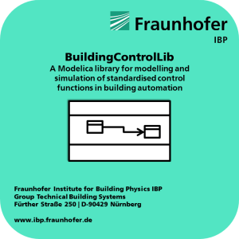

BuildingControlLib
==================

Welcome to BuildingControlLib, a Modelica library for modelling and simulation of standardized and non-standardized control functions from Building Automation Systems. The library is developed at maintained at the [Fraunhofer Institute for Building Physics IBP](https://www.ibp.fraunhofer.de/en.html) in the [Technical Building Systems Working Group](https://www.ibp.fraunhofer.de/en/Expertise/energy-efficiency-and-indoor-climate/TechnicalBuildingSystemsSolutions.html) in Nuremberg, Germany.

[comment]: <> (This is a comment, it will not be included)
### License

The model library **BuildingControlLib** is released by Fraunhofer Institute for Building Physics IBP under the [Modelica License 2.0](https://www.modelica.org/licenses/ModelicaLicense2).

### Dependencies

The libary uses models from the [**AixLib**-library](https://github.com/RWTH-EBC/AixLib), version 0.4.0 and models of the [Buildings-library](https://github.com/lbl-srg/modelica-buildings), version 4.0.0.

The library has been tested with Dymola 2017 FD01 64bit on Windows 7 64bit.

### Overview and implementation
#### VDI 3813

| Standard | control function | Implemented and tested |
|:---|:---|:---:|
|Sensor functions|||
||Presence detection|yes|
||Window monitoring|yes|
||Dewpoint monitoring|yes|
||Air temperature measurement|yes|
||Brightness measurement|yes|
||Air quality measurement|yes|
||Wind velocity measurement|yes|
||Precipitation detection|yes|
||Generic sensor function|no|
|Actuator functions| | |
||Light actuator|no|
||Sunshade actuator|yes|
||Control drive actuator|yes|
|Common I/O functions|||
||Joint common input function|-|
||Joint common output function|-|
|Operator and display functions|||
||Actuate light|no|
||Actuate sunshade|yes|
||Actuate drive|no|
||Adjust temperature setpoint|yes|
||Select room utilisation type|no|
||Signal presence|no|
|Application functions|||
|Basic|||
||Occupancy evaluation|yes|
||Control via room utilisation|no|
||Time program|yes|
||Partition wall control|no|
||Lighting|||
||Light control|no|
||Stairwell light control|no|
||Automatic lights|no|
||Daylight-dependent lighting|no|
||Constant-light control|no|
||Twilight control|no|
|Sunshading|||
||Priority control|yes|
||Automatic twilight control|yes|
||Automatic solar control|yes|
||Slat tracking|no|
||Shadow correction|no|
||Automatic thermal control|yes|
||Weather protection|no|
|Room climate|||
||Energy mode selection|yes|
||Energy mode selection with start option|no|
||Setpoint calculation|yes|
||Function selection|no|
||Temperature control (heating/cooling)|no|
||Room supply air cascade control|no|
||Fan control|no|
||Sequence control|no|
||Manipulated value limiting|no|
||Air quality control|no|
||Night-time cooling|no|
||Volume flow control|no|
|Management functions|||
||Input/output information|-|
||Complex information|-|
||Long-term event logging|-|
||Archiving in database|-|
|Operator functions|||
||Graphic/system diagram|no|
||Dynamic showing|no|
||Event statement text|no|
||Message to external recipient|no|

#### VDI 3814

| Standard | control function | Implemented and tested |
|:---|:---|:---:|
|| State Graph according to VDI 3814-6 | yes |
| I/O functions | | | 
|  | Binary output switching/positioning | no |  
|  | Analog output positioning | no |  
|  | Binary input state | no |  
|  | Binary input counting | no |  
|  | Analog input | no |  
|  | Binary value (output), switching | no |  
|  | Analog value (output), positioning/setpoint | no |  
|  | Binary value (input), state | no |  
|  | Accumulated/totalized value (input) | no |  
|  | Analog value (input), measuring | no | 
Management functions |  | |
|  | Input/output/value object types | no |  
|  | Complex object types | no |  
|  | Event storage | no |  
|  | Historical database | no | 
Operator functions |  |  |
|  | Graphic/static plant schematic | no |  
|  | Dynamic display | no |  
|  | Event instruction text | no |  
|  | Remote messaging | no | 
| Monitoring |||
|  | Fixed limit | no |  
|  | Sliding/Floating limit | no |  
|  | Run time totalization | no |
|  | Event counting | no | 
|  | Command execution check | no | 
|  | State processing | no |
| Interlocks |||
|  | Plant control | no |  | 
|  | Motor control | no |  | 
|  | Switchover | no |  | 
|  | Step control | no |  | 
|  | Safety/Frost protection control | no |  | 
| Closed loop control | ||
|  | P control loop | no | 
|  | PI/PID control loop | no | 
|  | Sliding/Floating/Curve setpoint | no |
|  | Proportional output stage | no |
|  | Proportional to on/off conversion | no |
|  | Proportional to pulse width modulation | no |
|  | Setpoint/Output limitation | no |
|  | Switchover of parameters | no |
| Calculation/ Optimization |||
|  | h,x directed control | no | 
|  | Arithmetic calculation | no |
|  | Event switching | no |
|  | Time schedule | no | 
|  | Optimum start/stop | no |
|  | Duty cycling | no |
|  | Night cooling | no |
|  | Room temperature limitation | no |
|  | Energy recovery | no |
|  | Backup power operation | no |
|  | Mains power recovery program | no |
|  | Peak load limitation | no |
|  | Energy tariff dependent switching | no |

#### Non-standardised

| Standard | control function | Implemented and tested |
|:---|:---|:---:|
| Non-standardized |||
|| Function1 | ready |
| | Function2 | notready |
 
 
 ### Future implementation projects
 
| Item | Timeframe |
|:---|:---|
 |||
| Redesign VDI 3813 to Non-Semantic connector| short term|
| Implement missing control functions VDI 3813 | mid term |
| Implement missing control functions VDI 3814| mid term |
| Implementation of control functions from ISO 16484 | long term |
| Implemention of control functions from ASHRAE 36| long term |
 

### Acknowledgements

So far the following persons from [Fraunhofer Institute for Building Physics IBP](https://www.ibp.fraunhofer.de/en.html) have contributed to **BuildingControlLib**:

Georg Peßler, 
[Georg Ferdinand Schneider](https://www.researchgate.net/profile/Georg_Schneider3)  

This research was performed as part of the [Energie Campus Nürnberg](http://www.encn.de/en/) and supported by funding through the "Aufbruch Bayern (Bavaria on the move)&rdquo; initiative of the state of Bavaria.

We like to thank the Verein Deutscher Ingenieure - VDI (German Association of Engineers), Düsseldorf, Germany for the granted right to use some of the parts of the VDI 3813 standard for documenting our library.

We would like to thank all developers from Modelica community and in particular of the Annex60 effort for their contributions and work.

### Version

The current version 0.1.0 is a pre-release.

### How to cite **BuildingControlLib**

When you use **BuildingControlLib** in your research please cite the following paper:

- Schneider, G. F., Peßler, G. and Steiger, S. (2017): _Modelling and Simulation of Standardised Control Functions from Building Automation_. In: Proceedings of 12th International Modelica Conference. 15th - 17th May, Prague, Czech Republic, DOI: 10.3384/ecp17132209 [pdf](https://modelica.org/events/modelica2017/proceedings/html/submissions/ecp17132209_SchneiderPelerSteiger.pdf).

### How to contribute to the development of BuildingControlLib

You are invited to contribute to the development of **BuildingControlLib**.
Issues can be reported using this site's [Issues section](https://github.com/TechnicalBuildingSystems/BuildingControlLib/issues).
Furthermore, you are welcome to contribute via [Pull Requests](https://github.com/TechnicalBuildingSystems/BuildingControlLib/pulls).

We recommend the workflow as suggested by state-of-the-art Modelica libraries, e.g. as described in the [Wiki](https://github.com/RWTH-EBC/AixLib/wiki). of **AixLib** library.

